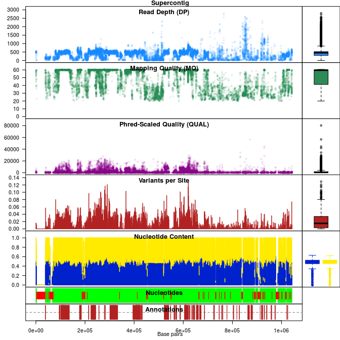

## VcfR: a package to manipulate and visualize [VCF](https://github.com/samtools/hts-specs) data in R

On CRAN:

Travis-CI:

Coveralls:

*****

VcfR is an R package intended to allow easy manipulation and visualization of variant call format (VCF) data.
Functions are provided to rapidly read from and write to VCF files.
Once VCF data is read into R a parser function extracts matrices from the VCF data for use with typical R functions.
This information can then be used for quality control or other purposes.
Additional functions provide visualization of genomic data.
Once processing is complete data may be written to a VCF file or converted into other popular R objects (e.g., genlight, DNAbin).
VcfR provides a link between VCF data and the R environment connecting familiar software with genomic data.

VcfR is built upon two data structures.

**vcfR** - S4 class to contain data from a VCF file.

**chromR** - S4 class to contain variant information (VCF) and optional sequence (FASTA) and annotation (GFF) information.

Functions in vcfR provide the ability to subset VCF data as well as to extract and parse the data.
For example, individual genotypes, sequence depths or genotype likelihoods (when provided in the VCF file) can easily be accessed.
These tools are provided to aid researchers in rapidly surveying the quality and other characteristics of data provided as VCF data.
With this information in hand, researchers should be able to determine criteria for hard filtering in order to attempt to maximize biological variation and minimize technical variation.

## Publication

Knaus, Brian J., and Niklaus J. Grunwald. In press. VCFR: a package to manipulate and visualize variant call format data in R. Molecular Ecology Resources. http://dx.doi.org/10.1111/1755-0998.12549.

Knaus, Brian J., and Niklaus J. Grunwald. 2016. VcfR: an R package to manipulate and visualize VCF format data. bioRxiv: 041277. http://dx.doi.org/10.1101/041277.

## Download

[vcfR](https://cran.r-project.org/package=vcfR) is available at CRAN.
To install use:

    install.packages('vcfR')

The development version can be installed through github:

    devtools::install_github(repo="knausb/vcfR")
    library(vcfR)

If you would like the vignettes use:

    devtools::install_github(repo="knausb/vcfR", build_vignettes=TRUE)

If you've built the vignettes, you can browse them with:

    browseVignettes(package="vcfR")

If you've installed this package with devtools you will probably need to run:

    devtools::install(build_vignettes = TRUE)
    

------

## Devel branch

The devel branch (which may not be stable) can also be installed:

    devtools::install_github(repo="knausb/vcfR@devel")
    library(vcfR)

And to build the vignettes:

    devtools::install_github(repo="knausb/vcfR@devel", build_vignettes=TRUE)

------

## Software that produce VCF files

A fun part of this project has been learning about how people use vcfR.
One facet of this is learning about the software that create VCF files.
So I've decided to make a list of these software.
If you know of a software that I have not included on this list, particularly if you can report that vcfR works with its files, feel free to let me know!

**Genomic variant callers:**

* [Cortex](http://cortexassembler.sourceforge.net/)
* [freebayes](https://github.com/ekg/freebayes)
* [GATK haplotype caller](https://www.broadinstitute.org/gatk/guide/tooldocs/org_broadinstitute_gatk_tools_walkers_haplotypecaller_HaplotypeCaller.php)
* [GATK MuTect2](https://www.broadinstitute.org/gatk/guide/tooldocs/org_broadinstitute_gatk_tools_walkers_cancer_m2_MuTect2.php)
* [GATK GenotypeGVCFs](https://www.broadinstitute.org/gatk/guide/tooldocs/org_broadinstitute_gatk_tools_walkers_variantutils_GenotypeGVCFs.php)
* [LoFreq](http://csb5.github.io/lofreq/)
* [Platypus](http://www.well.ox.ac.uk/platypus)
* [Samtools](http://www.htslib.org/)
* [VarScan2](http://dkoboldt.github.io/varscan/)

**Restriction site associated DNA markers (e.g., RADseq, GBS):**

* [Stacks](http://catchenlab.life.illinois.edu/stacks/)
* [Tassel](http://www.maizegenetics.net/#!tassel/c17q9)

**Manipulation of VCF data:**

* [Beagle v4.1](https://faculty.washington.edu/browning/beagle/beagle.html) Inputs VCF genotypes and outputs phased genotypes to VCF format
* [pegas::read.vcf](https://cran.r-project.org/package=pegas) Population and Evolutionary Genetics Analysis System
* [PyVCF](https://pyvcf.readthedocs.io/en/latest/)
* [SnpEff](http://snpeff.sourceforge.net/) Genetic variant annotation and effect prediction toolbox
* [Picard](http://broadinstitute.github.io/picard/index.html) A set of command line tools (in Java) for manipulating high-throughput sequencing (HTS) data and formats such as SAM/BAM/CRAM and VCF
* [VCFtools](https://vcftools.github.io/) General manipulation and analysis
* [VariantAnnotation::readVcf](https://bioconductor.org/packages/release/bioc/html/VariantAnnotation.html) Bioconductor package for annotating variants

**R packages that read VCF data**

* [VariantAnnotation](https://bioconductor.org/packages/release/bioc/html/VariantAnnotation.html)
* [pegas](https://cran.r-project.org/package=pegas)

------

Enjoy!
